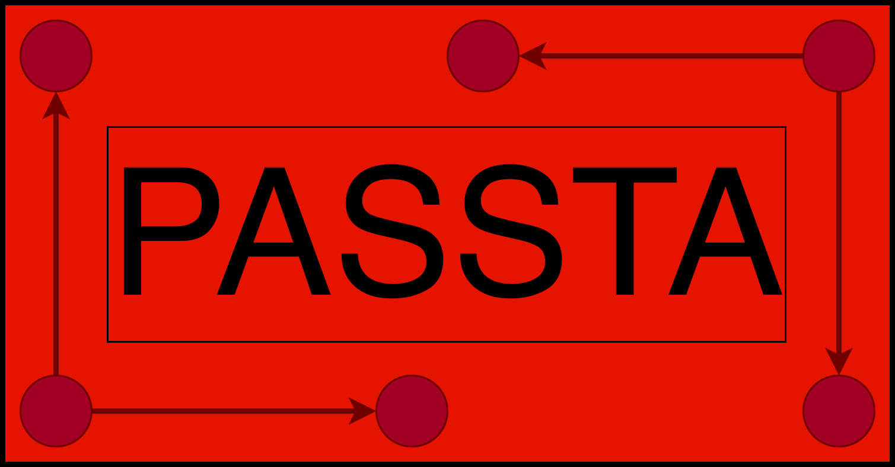

<p align="center">
  
</p>

<h1 align="center">PASSTA</h1>

<p align="center">
  Learning Stochastic Real-Time Automata from execution traces.
</p>

<p align="center">
  
  
  
  
  
  
</p>

<p align="center">
  🚧 In development 🚧
</p>

## Status

PASSTA is currently under active development. APIs, command-line options, and internal packages may change between versions.

## Quick start

The executable JAR is available in the `dist/` directory:

```text
dist/Passta-0.3.jar
```

Move into the `dist/` directory:

```bash
cd dist
```

Visualize an automaton in the browser:

```bash
java -jar Passta-0.3.jar view data/traces.json 2
```

Export an automaton to SVG:

```bash
java -jar Passta-0.3.jar export data/traces.json 2 out/automaton.svg
```

Export an automaton to UPPAAL:

```bash
java -jar Passta-0.3.jar export data/traces.json 2 out/model.xml
```

## Features

- Learns **Stochastic Real-Time Automata (SRTA)** from JSON execution traces.
- Processes large JSON trace files using streaming.
- Provides a command-line interface for direct usage.
- Opens learned automata in an interactive browser viewer with zooming and panning.
- Exports learned automata to `SVG`, `PNG`, and `UPPAAL` XML.
- Supports trace validation against learned automata.
- Can save rejected traces together with the reason for their rejection.

## Changelog

### 2026-07-03 - Version 0.3

- Project refactored into clearer core, I/O, automaton, trace, validation, and CLI packages.
- JSON trace processing is now performed using streaming, reducing memory usage for large trace files.
- Edge labels in the browser-based automaton visualization have been improved.
- Command-line interface mode added.
- Browser visualization command added.
- Location legend added to the UPPAAL export.

### 2026-01-12

- Parser `show()` method improved to work with all operating systems and browsers.
- The validation module has been extended with two additional methods that save rejected traces along with the reason for their rejection.

### 2025-10-15

- Adjustments in the merge algorithm to fix indeterminism as soon as possible in the in-out edges of the resulting merged state.

### 2025-07-16

- New custom UPPAAL parser has been developed.
- UPPAAL API dependency removed.

## Description

PASSTA is a tool that integrates an automata learning algorithm to automatically construct abstract models — **Stochastic Real-Time Automata (SRTA)** — from observations of real systems, such as execution traces.

PASSTA can be used in two ways:

- as a **command-line tool** through the provided CLI;
- as a **Java API** from another Java program.

## Architecture overview

```text
JSON traces
    │
    ▼
TraceReader
    │
    ▼
PASSTA learning algorithm
    │
    ▼
SRTA automaton
    │
    ├── Browser visualization
    ├── SVG / PNG export
    ├── UPPAAL export
    └── Trace validation
```

## Table of contents

- [Status](#status)
- [Quick start](#quick-start)
- [Features](#features)
- [Changelog](#changelog)
- [Description](#description)
- [Architecture overview](#architecture-overview)
- [Technologies](#technologies)
- [Installation](#installation)
- [Command-line usage](#command-line-usage)
- [CLI examples](#cli-examples)
- [Input traces format](#input-traces-format)
- [Output formats](#output-formats)
- [Example output](#example-output)
- [Java API usage](#java-api-usage)
- [Trace processing](#trace-processing)
- [Learning](#learning)
- [Visualization](#visualization)
- [Exporting automata](#exporting-automata)
- [Validation](#validation)
- [Project structure](#project-structure)
- [Citation](#citation)
- [License](#license)

## Technologies

PASSTA depends on:

- <a href="https://openjdk.org/" target="_blank">OpenJDK 21 or higher</a>
- <a href="https://maven.apache.org/" target="_blank">Apache Maven</a>
- <a href="https://github.com/FasterXML/jackson" target="_blank">Jackson</a>
- <a href="https://github.com/FasterXML/jackson-modules-base/tree/2.18/blackbird" target="_blank">Jackson Blackbird module</a>
- <a href="https://github.com/jamisonjiang/graph-support" target="_blank">graph-support</a>
- <a href="https://commons.apache.org/proper/commons-io/" target="_blank">commons-io</a>
- <a href="https://www.slf4j.org/" target="_blank">SLF4J</a>

## Installation

### Requirements

- Java Development Kit, JDK 21 or higher.
- Apache Maven, only required if building from source.
- A modern web browser for interactive visualization.

### JAR file

The executable JAR file is located in the `dist/` directory:

```text
dist/Passta-0.3.jar
```

This is a shaded, or fat, JAR that includes all project dependencies.

To run the README examples as written, first move into the `dist/` directory:

```bash
cd dist
```

Then execute PASSTA with:

```bash
java -jar Passta-0.3.jar --help
```

### From source code

If you want to rebuild the project from source, use Maven from the project root:

```bash
mvn package
```

The compiled JAR is generated in the `dist/` directory.

## Command-line usage

PASSTA 0.3 provides a command-line interface.

### General syntax

```bash
java -jar Passta-0.3.jar <command> [options]
```

### Available commands

- `view`: learns an automaton and opens it in the default web browser.
- `export`: learns an automaton and exports it to a file.
- `--help`: shows CLI help.
- `--version`: shows the current version.

### Show help

```bash
java -jar Passta-0.3.jar --help
```

### Show version

```bash
java -jar Passta-0.3.jar --version
```

### View an automaton in the browser

```bash
java -jar Passta-0.3.jar view data/traces.json 2
```

Named options are also supported:

```bash
java -jar Passta-0.3.jar view   --input data/traces.json   --k 2
```

The browser viewer provides an interactive SVG view with zooming and panning.

### Export an automaton

Default export format is inferred from the output file extension.

```bash
java -jar Passta-0.3.jar export data/traces.json 2 out/automaton.svg
```

The following shorthand form is also supported:

```bash
java -jar Passta-0.3.jar data/traces.json 2 out/automaton.svg
```

If no output file is provided, PASSTA exports to:

```text
automaton.svg
```

Example:

```bash
java -jar Passta-0.3.jar data/traces.json 2
```

### Export as PNG

```bash
java -jar Passta-0.3.jar export data/traces.json 2 out/automaton.png
```

or using named options:

```bash
java -jar Passta-0.3.jar export   --input data/traces.json   --k 2   --output out/automaton.png
```

### Export to UPPAAL

```bash
java -jar Passta-0.3.jar export data/traces.json 2 out/model.xml
```

or explicitly:

```bash
java -jar Passta-0.3.jar export   --input data/traces.json   --k 2   --format UPPAAL   --output out/model.xml
```

### Verbose mode

Use `--verbose` to print additional execution information:

```bash
java -jar Passta-0.3.jar view data/traces.json 2 --verbose
```

## CLI examples

```bash
# Visualize the learned automaton in the browser
java -jar Passta-0.3.jar view data/traces.json 2

# Export to SVG
java -jar Passta-0.3.jar export data/traces.json 2 out/automaton.svg

# Export to PNG
java -jar Passta-0.3.jar export data/traces.json 2 out/automaton.png

# Export to UPPAAL
java -jar Passta-0.3.jar export data/traces.json 2 out/model.xml
```

## Input traces format

PASSTA expects a JSON file containing an array of traces. Each trace contains a list of observations.

Each observation has:

- `time`: elapsed time from the beginning of the trace;
- `event`: event name, or an empty string when no event occurs;
- `variables`: list of observed system attributes.

Example:

```json
[
  {
    "obs": [
      {
        "time": 0.0,
        "event": "",
        "variables": ["Initializing"]
      },
      {
        "time": 13983775.0,
        "event": "Init_complete",
        "variables": ["Listening"]
      },
      {
        "time": 13986382.0,
        "event": "Init_complete",
        "variables": ["Listening"]
      },
      {
        "time": 14311815.0,
        "event": "Rs_slave",
        "variables": ["Uncalibrated"]
      },
      {
        "time": 14881755.0,
        "event": "Master_clock_selected",
        "variables": ["Slave"]
      }
    ]
  }
]
```

More examples of traces can be found in:

```text
ptp4lv3 and ptp4lv4
```

## Output formats

PASSTA can generate the following outputs:

- browser visualization;
- `SVG` image;
- `PNG` image;
- `UPPAAL` XML model.

Supported export formats are:

- `SVG`: scalable vector graphics representation.
- `PNG`: raster image representation.
- `UPPAAL`: XML model for UPPAAL-style timed automata workflows.

## Example output

Depending on the selected command and export format, PASSTA can generate files such as:

```text
out/
├── automaton.svg      Graphical representation of the learned SRTA
├── automaton.png      Raster image of the learned SRTA
└── model.xml          UPPAAL-compatible XML model
```

## Java API usage

PASSTA can also be used programmatically from Java.

A minimal example that learns an automaton and exports it to SVG:

```java
import java.nio.file.Path;

import es.uma.morse.passta.core.Passta;
import es.uma.morse.passta.core.automaton.SRTA;
import es.uma.morse.passta.io.AutomatonExportFormat;
import es.uma.morse.passta.io.AutomatonExporter;

public class Example {

    public static void main(String[] args) {
        Passta passta = new Passta(Path.of("data/traces.json"), 2);
        SRTA automaton = passta.getAutomaton();

        AutomatonExporter.export(
            automaton,
            Path.of("out/automaton.svg"),
            AutomatonExportFormat.SVG
        );
    }
}
```

## Trace processing

Traces can be read from JSON using `TraceReader`.

```java
import java.nio.file.Path;
import java.util.List;

import es.uma.morse.passta.core.trace.Trace;
import es.uma.morse.passta.io.TraceReader;

public class TraceReaderExample {

    public static void main(String[] args) {
        Path tracesPath = Path.of("src/main/resources/traces.json");

        List<Trace> traces = TraceReader.readTraces(tracesPath);

        System.out.println("Loaded traces: " + traces.size());
    }
}
```

For large trace files, PASSTA supports streaming traces without loading the whole file into memory:

```java
import java.nio.file.Path;

import com.fasterxml.jackson.databind.MappingIterator;

import es.uma.morse.passta.core.trace.Trace;
import es.uma.morse.passta.io.TraceReader;

public class TraceStreamingExample {

    public static void main(String[] args) throws Exception {
        Path tracesPath = Path.of("src/main/resources/traces.json");

        try (MappingIterator<Trace> traces = TraceReader.streamTraces(tracesPath)) {
            while (traces.hasNext()) {
                Trace trace = traces.next();
                System.out.println(trace);
            }
        }
    }
}
```

Traces can be written using `TraceWriter`:

```java
import java.nio.file.Path;
import java.util.List;

import es.uma.morse.passta.core.trace.Trace;
import es.uma.morse.passta.io.TraceReader;
import es.uma.morse.passta.io.TraceWriter;

public class TraceWriterExample {

    public static void main(String[] args) {
        List<Trace> traces = TraceReader.readTraces(Path.of("src/main/resources/traces.json"));

        TraceWriter.writeTraces(
            Path.of("out/traces-copy.json"),
            traces
        );
    }
}
```

## Learning

Create a `Passta` instance from a JSON traces file and a value for `k`.

```java
import java.nio.file.Path;

import es.uma.morse.passta.core.Passta;
import es.uma.morse.passta.core.automaton.SRTA;

public class LearningExample {

    public static void main(String[] args) {
        Path tracesPath = Path.of("src/main/resources/traces.json");
        int k = 2;

        Passta passta = new Passta(tracesPath, k);
        SRTA automaton = passta.getAutomaton();

        System.out.println(automaton);
    }
}
```

You can also create the learner from a string path:

```java
import es.uma.morse.passta.core.Passta;
import es.uma.morse.passta.core.automaton.SRTA;

public class LearningFromStringExample {

    public static void main(String[] args) {
        Passta passta = new Passta("src/main/resources/traces.json", 2);
        SRTA automaton = passta.getAutomaton();

        System.out.println(automaton);
    }
}
```

## Visualization

Automata can be visualized in the default web browser using `AutomatonViewer`.

```java
import java.nio.file.Path;

import es.uma.morse.passta.core.Passta;
import es.uma.morse.passta.core.automaton.SRTA;
import es.uma.morse.passta.io.AutomatonViewer;

public class BrowserVisualizationExample {

    public static void main(String[] args) {
        Passta passta = new Passta(Path.of("src/main/resources/traces.json"), 2);
        SRTA automaton = passta.getAutomaton();

        AutomatonViewer.show(automaton);
    }
}
```

## Exporting automata

Automata can be exported using `AutomatonExporter`.

### Export to SVG

```java
import java.nio.file.Path;

import es.uma.morse.passta.core.Passta;
import es.uma.morse.passta.core.automaton.SRTA;
import es.uma.morse.passta.io.AutomatonExportFormat;
import es.uma.morse.passta.io.AutomatonExporter;

public class SvgExportExample {

    public static void main(String[] args) {
        Passta passta = new Passta(Path.of("src/main/resources/traces.json"), 2);
        SRTA automaton = passta.getAutomaton();

        AutomatonExporter.export(
            automaton,
            Path.of("out/automaton.svg"),
            AutomatonExportFormat.SVG
        );
    }
}
```

### Export to PNG

```java
import java.nio.file.Path;

import es.uma.morse.passta.core.Passta;
import es.uma.morse.passta.core.automaton.SRTA;
import es.uma.morse.passta.io.AutomatonExportFormat;
import es.uma.morse.passta.io.AutomatonExporter;

public class PngExportExample {

    public static void main(String[] args) {
        Passta passta = new Passta(Path.of("src/main/resources/traces.json"), 2);
        SRTA automaton = passta.getAutomaton();

        AutomatonExporter.export(
            automaton,
            Path.of("out/automaton.png"),
            AutomatonExportFormat.PNG
        );
    }
}
```

### Export to UPPAAL

```java
import java.nio.file.Path;

import es.uma.morse.passta.core.Passta;
import es.uma.morse.passta.core.automaton.SRTA;
import es.uma.morse.passta.io.AutomatonExportFormat;
import es.uma.morse.passta.io.AutomatonExporter;

public class UppaalExportExample {

    public static void main(String[] args) {
        Passta passta = new Passta(Path.of("src/main/resources/traces.json"), 2);
        SRTA automaton = passta.getAutomaton();

        AutomatonExporter.export(
            automaton,
            Path.of("out/model.xml"),
            AutomatonExportFormat.UPPAAL
        );
    }
}
```

## Validation

The validation module can be used to check whether traces are accepted by a learned automaton.

```java
import java.nio.file.Path;
import java.util.List;

import es.uma.morse.passta.core.Passta;
import es.uma.morse.passta.core.automaton.SRTA;
import es.uma.morse.passta.core.trace.Trace;
import es.uma.morse.passta.io.TraceReader;
import es.uma.morse.passta.validation.Validator;

public class ValidationExample {

    public static void main(String[] args) {
        Path trainingTraces = Path.of("src/main/resources/training-traces.json");
        Path validationTraces = Path.of("src/main/resources/validation-traces.json");

        Passta passta = new Passta(trainingTraces, 2);
        SRTA automaton = passta.getAutomaton();

        List<Trace> testTraces = TraceReader.readTraces(validationTraces);

        System.out.println(
            Validator.nValidTraces(testTraces, automaton)
        );
    }
}
```

Rejected traces can also be saved together with the reason for their rejection:

```java
import java.nio.file.Path;
import java.util.List;

import es.uma.morse.passta.core.Passta;
import es.uma.morse.passta.core.automaton.SRTA;
import es.uma.morse.passta.core.trace.Trace;
import es.uma.morse.passta.io.TraceReader;
import es.uma.morse.passta.validation.Validator;

public class ValidationWithRejectedTracesExample {

    public static void main(String[] args) {
        Path trainingTraces = Path.of("src/main/resources/training-traces.json");
        Path validationTraces = Path.of("src/main/resources/validation-traces.json");
        Path rejectedOutput = Path.of("out/rejected-traces");

        Passta passta = new Passta(trainingTraces, 2);
        SRTA automaton = passta.getAutomaton();

        List<Trace> testTraces = TraceReader.readTraces(validationTraces);

        System.out.println(
            Validator.nValidTraces(
                testTraces,
                automaton,
                rejectedOutput.toString()
            )
        );
    }
}
```

## Project structure

```text
src/main/java/es/uma/morse/passta
├── cli          Command-line interface
├── core         PASSTA learning algorithm and core model
├── core/automaton
├── core/trace
├── io           Readers, writers, exporters, UPPAAL output, and visualization
└── validation   Trace validation utilities
```

## Citation

If you use PASSTA in academic work, please cite the following article:

```bibtex
@article{LOPEZGOMEZ2026101142,
  title = {Towards a formal digital twin of the PTP protocol using automata learning},
  journal = {Journal of Logical and Algebraic Methods in Programming},
  volume = {151},
  pages = {101142},
  year = {2026},
  issn = {2352-2208},
  doi = {https://doi.org/10.1016/j.jlamp.2026.101142},
  url = {https://www.sciencedirect.com/science/article/pii/S2352220826000349},
  author = {Rafael López-Gómez and Delia Rico and Laura Panizo and María-del-Mar Gallardo},
  keywords = {Time-Sensitive Systems, Formal Digital Twin, Formal Verification}
}
```

## License

This project is licensed under the GNU Affero General Public License v3.0.

See the `LICENSE` file for details.
