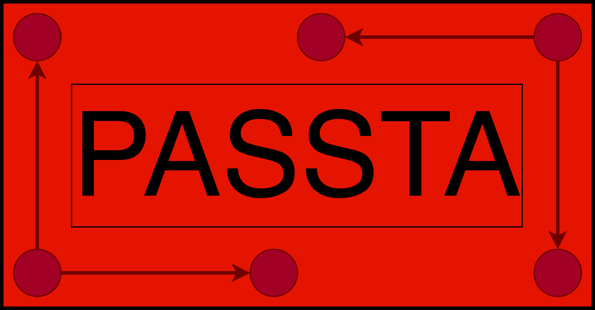

<p align="center">
  
</p>

<h1 align="center">PASSTA</h1>

<p align="center">
  Learning Stochastic Real-Time Automata from execution traces.
</p>

<p align="center">
  
  
  
  
  
  
</p>

<p align="center">
  🚧 In development 🚧
</p>

## Status

PASSTA is currently under active development. APIs, command-line options, and internal packages may change between versions.

## Quick start

The executable JAR is available in the `dist/` directory:

```text
dist/Passta-0.3.1.jar
```

Move into the `dist/` directory:

```bash
cd dist
```

Visualize an automaton in the browser:

```bash
java -jar Passta-0.3.1.jar view data/traces.json 2
```

Export an automaton to SVG:

```bash
java -jar Passta-0.3.1.jar export data/traces.json 2 out/automaton.svg
```

Export an automaton to UPPAAL:

```bash
java -jar Passta-0.3.1.jar export data/traces.json 2 out/model.xml
```

## Features

- Learns **Stochastic Real-Time Automata (SRTA)** from JSON execution traces.
- Reads traces lazily through `Stream<Trace>`, avoiding the need to load the complete input into memory.
- Uses a central `TraceReader.readTraces(...)` entry point for JSON files and directories containing JSON files.
- Provides a command-line interface for direct usage.
- Opens learned automata in an interactive browser viewer with zooming and panning.
- Exports learned automata to `SVG`, `PNG`, and `UPPAAL` XML.
- Supports trace validation against learned automata.
- Returns validation statistics through `ValidationResult`, including total, accepted, and rejected traces.
- Can save rejected traces together with the reason for their rejection.

## Changelog

### 2026-10-01 - Version 0.3.1

- `TraceReader.readTraces(...)` now returns a lazy `Stream<Trace>` instead of a materialized `List<Trace>`.
- Trace reading has been centralized in `TraceReader.readTraces(...)`, which accepts either a JSON file or a directory containing JSON files.
- JSON files in a directory are processed in deterministic filename order.
- Input streams and Jackson iterators are closed through the stream `onClose` mechanism and should be consumed using `try-with-resources`.
- The previous public streaming-specific usage based on `MappingIterator` has been replaced by the standard Java Stream API.
- Validation entry points have been refactored to accept a source `Path` or `String` directly, instead of requiring callers to load traces beforehand.
- Validation now processes traces incrementally and compresses each trace before checking it against the automaton.
- `Validator.nValidTraces(...)` now returns a `ValidationResult` containing the total and accepted trace counts. The rejected count and acceptance rate are derived from these values.
- Rejected traces can still be written to a JSON destination, including diagnostic information explaining the rejection.
- Java API examples and documentation have been updated for the new stream-based trace-reading and validation APIs.

### 2026-07-03 - Version 0.3

- Project refactored into clearer core, I/O, automaton, trace, validation, and CLI packages.
- JSON trace processing was updated to reduce memory usage for large trace files.
- Edge labels in the browser-based automaton visualization were improved.
- Command-line interface mode added.
- Browser visualization command added.
- Location legend added to the UPPAAL export.

### 2026-01-12

- Parser `show()` method improved to work with all operating systems and browsers.
- The validation module was extended with methods that save rejected traces together with the reason for their rejection.

### 2025-10-15

- Adjustments in the merge algorithm to fix indeterminism as soon as possible in the in-out edges of the resulting merged state.

### 2025-07-16

- New custom UPPAAL parser developed.
- UPPAAL API dependency removed.

## Description

PASSTA is a tool that integrates an automata learning algorithm to automatically construct abstract models, **Stochastic Real-Time Automata (SRTA)**, from observations of real systems, such as execution traces.

PASSTA can be used in two ways:

- as a **command-line tool** through the provided CLI;
- as a **Java API** from another Java program.

## Architecture overview

```text
JSON trace file or directory
    │
    ▼
TraceReader.readTraces(...)
    │
    ▼
Stream<Trace>
    │
    ├── PASSTA learning algorithm
    │       │
    │       ▼
    │    SRTA automaton
    │       │
    │       ├── Browser visualization
    │       ├── SVG / PNG export
    │       └── UPPAAL export
    │
    └── Validator
            │
            ├── ValidationResult
            └── Rejected traces JSON
```

## Table of contents

- [Status](#status)
- [Quick start](#quick-start)
- [Features](#features)
- [Changelog](#changelog)
- [Description](#description)
- [Architecture overview](#architecture-overview)
- [Technologies](#technologies)
- [Installation](#installation)
- [Command-line usage](#command-line-usage)
- [CLI examples](#cli-examples)
- [Input traces format](#input-traces-format)
- [Output formats](#output-formats)
- [Example output](#example-output)
- [Java API usage](#java-api-usage)
- [Trace processing](#trace-processing)
- [Learning](#learning)
- [Visualization](#visualization)
- [Exporting automata](#exporting-automata)
- [Validation](#validation)
- [Project structure](#project-structure)
- [Citation](#citation)
- [License](#license)

## Technologies

PASSTA depends on:

- <a href="https://openjdk.org/" target="_blank">OpenJDK 21 or higher</a>
- <a href="https://maven.apache.org/" target="_blank">Apache Maven</a>
- <a href="https://github.com/FasterXML/jackson" target="_blank">Jackson</a>
- <a href="https://github.com/FasterXML/jackson-modules-base/tree/2.18/blackbird" target="_blank">Jackson Blackbird module</a>
- <a href="https://github.com/jamisonjiang/graph-support" target="_blank">graph-support</a>
- <a href="https://commons.apache.org/proper/commons-io/" target="_blank">commons-io</a>
- <a href="https://www.slf4j.org/" target="_blank">SLF4J</a>

## Installation

### Requirements

- Java Development Kit, JDK 21 or higher.
- Apache Maven, only required if building from source.
- A modern web browser for interactive visualization.

### JAR file

The executable JAR file is located in the `dist/` directory:

```text
dist/Passta-0.3.1.jar
```

This is a shaded, or fat, JAR that includes all project dependencies.

To run the README examples as written, first move into the `dist/` directory:

```bash
cd dist
```

Then execute PASSTA with:

```bash
java -jar Passta-0.3.1.jar --help
```

### From source code

If you want to rebuild the project from source, use Maven from the project root:

```bash
mvn package
```

The compiled JAR is generated in the `dist/` directory.

## Command-line usage

PASSTA 0.3.1 provides a command-line interface.

### General syntax

```bash
java -jar Passta-0.3.1.jar <command> [options]
```

### Available commands

- `view`: learns an automaton and opens it in the default web browser.
- `export`: learns an automaton and exports it to a file.
- `--help`: shows CLI help.
- `--version`: shows the current version.

### Show help

```bash
java -jar Passta-0.3.1.jar --help
```

### Show version

```bash
java -jar Passta-0.3.1.jar --version
```

### View an automaton in the browser

```bash
java -jar Passta-0.3.1.jar view data/traces.json 2
```

Named options are also supported:

```bash
java -jar Passta-0.3.1.jar view --input data/traces.json --k 2
```

The browser viewer provides an interactive SVG view with zooming and panning.

### Export an automaton

The default export format is inferred from the output file extension.

```bash
java -jar Passta-0.3.1.jar export data/traces.json 2 out/automaton.svg
```

The following shorthand form is also supported:

```bash
java -jar Passta-0.3.1.jar data/traces.json 2 out/automaton.svg
```

If no output file is provided, PASSTA exports to:

```text
automaton.svg
```

Example:

```bash
java -jar Passta-0.3.1.jar data/traces.json 2
```

### Export as PNG

```bash
java -jar Passta-0.3.1.jar export data/traces.json 2 out/automaton.png
```

or using named options:

```bash
java -jar Passta-0.3.1.jar export --input data/traces.json --k 2 --output out/automaton.png
```

### Export to UPPAAL

```bash
java -jar Passta-0.3.1.jar export data/traces.json 2 out/model.xml
```

or explicitly:

```bash
java -jar Passta-0.3.1.jar export --input data/traces.json --k 2 --format UPPAAL --output out/model.xml
```

### Verbose mode

Use `--verbose` to print additional execution information:

```bash
java -jar Passta-0.3.1.jar view data/traces.json 2 --verbose
```

## CLI examples

```bash
# Visualize the learned automaton in the browser
java -jar Passta-0.3.1.jar view data/traces.json 2

# Export to SVG
java -jar Passta-0.3.1.jar export data/traces.json 2 out/automaton.svg

# Export to PNG
java -jar Passta-0.3.1.jar export data/traces.json 2 out/automaton.png

# Export to UPPAAL
java -jar Passta-0.3.1.jar export data/traces.json 2 out/model.xml
```

## Input traces format

PASSTA expects JSON files whose root element is an array of traces. Each trace contains a list of observations.

Each observation has:

- `time`: elapsed time from the beginning of the trace;
- `event`: event name, or an empty string when no event occurs;
- `variables`: list of observed system attributes.

Example:

```json
[
  {
    "obs": [
      {
        "time": 0.0,
        "event": "",
        "variables": ["Initializing"]
      },
      {
        "time": 13983775.0,
        "event": "Init_complete",
        "variables": ["Listening"]
      },
      {
        "time": 13986382.0,
        "event": "Init_complete",
        "variables": ["Listening"]
      },
      {
        "time": 14311815.0,
        "event": "Rs_slave",
        "variables": ["Uncalibrated"]
      },
      {
        "time": 14881755.0,
        "event": "Master_clock_selected",
        "variables": ["Slave"]
      }
    ]
  }
]
```

`TraceReader.readTraces(...)` accepts either:

- a regular `.json` file;
- a directory whose directly contained `.json` files will be processed in filename order.

More examples of traces can be found in:

```text
ptp4lv3 and ptp4lv4
```

## Output formats

PASSTA can generate the following outputs:

- browser visualization;
- `SVG` image;
- `PNG` image;
- `UPPAAL` XML model;
- JSON files containing rejected traces and validation diagnostics.

Supported automaton export formats are:

- `SVG`: scalable vector graphics representation.
- `PNG`: raster image representation.
- `UPPAAL`: XML model for UPPAAL-style timed automata workflows.

## Example output

Depending on the selected operation and export format, PASSTA can generate files such as:

```text
out/
├── automaton.svg          Graphical representation of the learned SRTA
├── automaton.png          Raster image of the learned SRTA
├── model.xml              UPPAAL-compatible XML model
└── rejected-traces.json   Rejected traces with validation diagnostics
```

## Java API usage

PASSTA can also be used programmatically from Java.

A minimal example that learns an automaton and exports it to SVG:

```java
import java.nio.file.Path;

import es.uma.morse.passta.core.Passta;
import es.uma.morse.passta.core.automaton.SRTA;
import es.uma.morse.passta.io.AutomatonExportFormat;
import es.uma.morse.passta.io.AutomatonExporter;

public class Example {

    public static void main(String[] args) {
        Passta passta = new Passta(Path.of("data/traces.json"), 2);
        SRTA automaton = passta.getAutomaton();

        AutomatonExporter.export(
            automaton,
            Path.of("out/automaton.svg"),
            AutomatonExportFormat.SVG
        );
    }
}
```

## Trace processing

Since version 0.3.1, the central entry point for reading traces is `TraceReader.readTraces(...)`. It returns a sequential `Stream<Trace>` and accepts either a JSON file or a directory containing JSON files.

Because the stream may keep input files open while it is being consumed, it must be closed using `try-with-resources`:

```java
import java.nio.file.Path;
import java.util.stream.Stream;

import es.uma.morse.passta.core.trace.Trace;
import es.uma.morse.passta.io.TraceReader;

public class TraceReaderExample {

    public static void main(String[] args) {
        Path source = Path.of("src/main/resources/traces.json");

        try (Stream<Trace> traces = TraceReader.readTraces(source)) {
            traces.forEach(System.out::println);
        }
    }
}
```

The same method can read all JSON files directly contained in a directory:

```java
Path sourceDirectory = Path.of("src/main/resources/traces");

try (Stream<Trace> traces = TraceReader.readTraces(sourceDirectory)) {
    long numberOfTraces = traces.count();
    System.out.println("Loaded traces: " + numberOfTraces);
}
```

JSON files found in a directory are processed in deterministic filename order. Subdirectories are not traversed recursively.

A stream is single-use. After a terminal operation such as `count()`, `forEach(...)`, `toList()`, or `collect(...)`, open a new stream if the traces must be processed again.

If a component specifically requires a list, materialize the stream explicitly:

```java
import java.nio.file.Path;
import java.util.List;
import java.util.stream.Stream;

import es.uma.morse.passta.core.trace.Trace;
import es.uma.morse.passta.io.TraceReader;
import es.uma.morse.passta.io.TraceWriter;

public class TraceWriterExample {

    public static void main(String[] args) {
        Path source = Path.of("src/main/resources/traces.json");
        Path destination = Path.of("out/traces-copy.json");

        try (Stream<Trace> traceStream = TraceReader.readTraces(source)) {
            List<Trace> traces = traceStream.toList();
            TraceWriter.writeTraces(destination, traces);
        }
    }
}
```

`Stream.toList()` is available in the Java version required by PASSTA. The previous direct assignment of `TraceReader.readTraces(...)` to a `List<Trace>` is no longer valid in version 0.3.1.

## Learning

Create a `Passta` instance from a JSON traces source and a value for `k`.

```java
import java.nio.file.Path;

import es.uma.morse.passta.core.Passta;
import es.uma.morse.passta.core.automaton.SRTA;

public class LearningExample {

    public static void main(String[] args) {
        Path tracesPath = Path.of("src/main/resources/traces.json");
        int k = 2;

        Passta passta = new Passta(tracesPath, k);
        SRTA automaton = passta.getAutomaton();

        System.out.println(automaton);
    }
}
```

You can also create the learner from a string path:

```java
import es.uma.morse.passta.core.Passta;
import es.uma.morse.passta.core.automaton.SRTA;

public class LearningFromStringExample {

    public static void main(String[] args) {
        Passta passta = new Passta("src/main/resources/traces.json", 2);
        SRTA automaton = passta.getAutomaton();

        System.out.println(automaton);
    }
}
```

## Visualization

Automata can be visualized in the default web browser using `AutomatonViewer`.

```java
import java.nio.file.Path;

import es.uma.morse.passta.core.Passta;
import es.uma.morse.passta.core.automaton.SRTA;
import es.uma.morse.passta.io.AutomatonViewer;

public class BrowserVisualizationExample {

    public static void main(String[] args) {
        Passta passta = new Passta(Path.of("src/main/resources/traces.json"), 2);
        SRTA automaton = passta.getAutomaton();

        AutomatonViewer.show(automaton);
    }
}
```

## Exporting automata

Automata can be exported using `AutomatonExporter`.

### Export to SVG

```java
AutomatonExporter.export(
    automaton,
    Path.of("out/automaton.svg"),
    AutomatonExportFormat.SVG
);
```

### Export to PNG

```java
AutomatonExporter.export(
    automaton,
    Path.of("out/automaton.png"),
    AutomatonExportFormat.PNG
);
```

### Export to UPPAAL

```java
AutomatonExporter.export(
    automaton,
    Path.of("out/model.xml"),
    AutomatonExportFormat.UPPAAL
);
```

A complete export example requires these imports:

```java
import java.nio.file.Path;

import es.uma.morse.passta.core.Passta;
import es.uma.morse.passta.core.automaton.SRTA;
import es.uma.morse.passta.io.AutomatonExportFormat;
import es.uma.morse.passta.io.AutomatonExporter;
```

## Validation

The validation module checks whether traces are accepted by a learned automaton. Since version 0.3.1, callers pass the validation source directly to `Validator`, so validation traces do not need to be loaded into a list beforehand.

`Validator.nValidTraces(...)` returns a `ValidationResult` with:

- `totalTraces()`: total number of processed traces;
- `acceptedTraces()`: number of traces accepted by the automaton;
- `rejectedTraces()`: number of rejected traces, calculated as total minus accepted;
- `acceptanceRate()`: accepted proportion as a value between `0.0` and `1.0`.

```java
import java.nio.file.Path;

import es.uma.morse.passta.core.Passta;
import es.uma.morse.passta.core.automaton.SRTA;
import es.uma.morse.passta.validation.ValidationResult;
import es.uma.morse.passta.validation.Validator;

public class ValidationExample {

    public static void main(String[] args) {
        Path trainingSource = Path.of(
            "src/main/resources/training-traces.json"
        );

        Path validationSource = Path.of(
            "src/main/resources/validation-traces.json"
        );

        Passta passta = new Passta(trainingSource, 2);
        SRTA automaton = passta.getAutomaton();

        ValidationResult result = Validator.nValidTraces(
            validationSource,
            automaton
        );

        System.out.println("Total traces: " + result.totalTraces());
        System.out.println("Accepted traces: " + result.acceptedTraces());
        System.out.println("Rejected traces: " + result.rejectedTraces());
        System.out.printf(
            "Acceptance rate: %.2f%%%n",
            result.acceptanceRate() * 100.0
        );
    }
}
```

Rejected traces can also be saved together with the reason for their rejection:

```java
import java.nio.file.Path;

import es.uma.morse.passta.core.Passta;
import es.uma.morse.passta.core.automaton.SRTA;
import es.uma.morse.passta.validation.ValidationResult;
import es.uma.morse.passta.validation.Validator;

public class ValidationWithRejectedTracesExample {

    public static void main(String[] args) {
        Path trainingSource = Path.of(
            "src/main/resources/training-traces.json"
        );

        Path validationSource = Path.of(
            "src/main/resources/validation-traces.json"
        );

        Path rejectedOutput = Path.of(
            "out/rejected-traces.json"
        );

        Passta passta = new Passta(trainingSource, 2);
        SRTA automaton = passta.getAutomaton();

        ValidationResult result = Validator.nValidTraces(
            validationSource,
            automaton,
            rejectedOutput
        );

        System.out.println(
            "Accepted "
                + result.acceptedTraces()
                + " of "
                + result.totalTraces()
                + " traces"
        );

        if (result.rejectedTraces() > 0) {
            System.out.println(
                "Rejected traces written to: "
                    + rejectedOutput.toAbsolutePath().normalize()
            );
        }
    }
}
```

During validation, each trace is compressed using `Passta.compressTrace(...)` before it is checked against the automaton. If a destination is provided and at least one trace is rejected, the compressed rejected traces are written to that destination with diagnostic information added to the observation where validation failed.

For direct validation of an individual trace, use:

```java
boolean accepted = Validator.checkTrace(trace, automaton);
```

The method overloads accept source and destination paths as either `Path` or `String`. A `null` or blank string destination disables rejected-trace output.

## Project structure

```text
src/main/java/es/uma/morse/passta
├── cli          Command-line interface
├── core         PASSTA learning algorithm and core model
├── core/automaton
├── core/trace
├── io           Readers, writers, exporters, UPPAAL output, and visualization
└── validation   Trace validation and ValidationResult
```

## Citation

If you use PASSTA in academic work, please cite the following article:

```bibtex
@article{LOPEZGOMEZ2026101142,
  title = {Towards a formal digital twin of the PTP protocol using automata learning},
  journal = {Journal of Logical and Algebraic Methods in Programming},
  volume = {151},
  pages = {101142},
  year = {2026},
  issn = {2352-2208},
  doi = {10.1016/j.jlamp.2026.101142},
  url = {https://www.sciencedirect.com/science/article/pii/S2352220826000349},
  author = {Rafael López-Gómez and Delia Rico and Laura Panizo and María-del-Mar Gallardo},
  keywords = {Time-Sensitive Systems, Formal Digital Twin, Formal Verification}
}
```

## License

This project is licensed under the GNU Affero General Public License v3.0.

See the `LICENSE` file for details.
